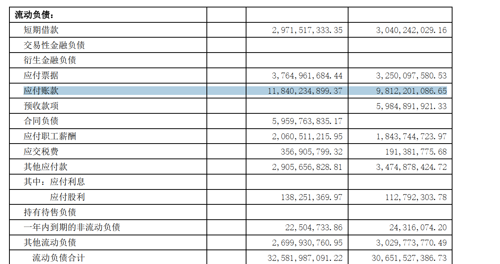
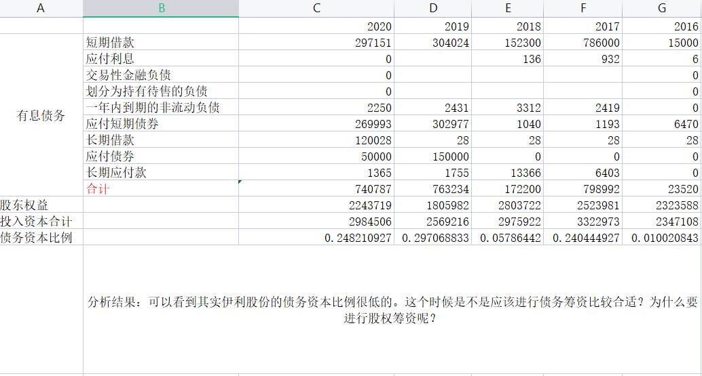
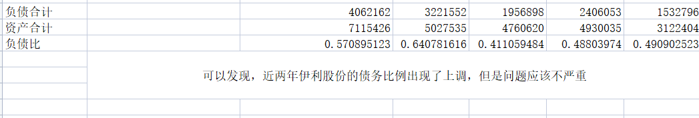
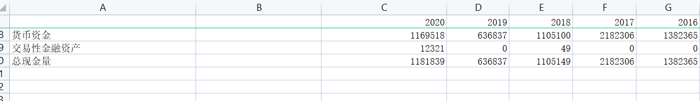
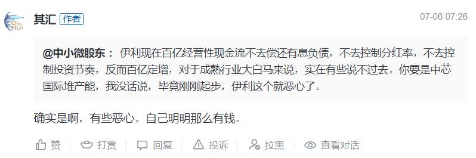
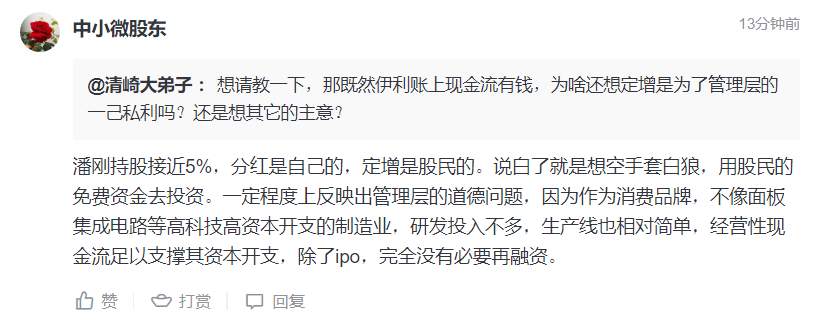

# 1.债务分析
## 1.1 有息负债
并不是所有的负债都是坏的，例如下图中的“应付账款”就是一个很好的例子，要知道应付账款是不需要付利息的，所以在分析有息债务的时候，就不应该将其囊括。

根据上面的分析，我们计算有息债务，同时计算其在投入资本中的比例，得到结果如下图所示：

得到的结论有：
- 因为占比大部分的都是应付账款和合同负债，应付职工薪酬这种无息负债。有息负债占比还是很少的，所以可以放心这种负债问题不大。
- 公司在应付款项和合同负债的强势说明其地位也是不错的。但是同时也表明公司欠的钱是不是有点儿多了？

## 1.2 总负债
如果单看资产负债表中的资产和负债的情况，其分析如下

# 2.公司为何要定增？
伊利现在百亿现金流，在雪球上有一篇对伊利的分析，里面有个人评论就说，为何百亿现金流还搞股权筹资（定增）？

我也觉得纳闷儿，这不合常理的对吧。
咨询了一下雪球里面的大佬，如下：

这个老哥说的很有道理，定增确实是这个样子，我涉世未深，公司的方方面面我都不熟悉，如果一个想打股票的歪主意，是极其容易的，这么来看，伊利的定增是减分项。

# 3. 管理费用